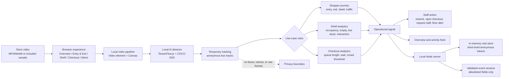

# ShelfSentinel high-level architecture

ShelfSentinel is a privacy-first, single-store analytics prototype. A store team selects a recording, the browser analyzes it locally, and the server receives only small anonymous operational events.

## System view



## Runtime flow

1. **Select a scenario.** The Overview page provides one presentation panel. Footfall, shopper journey, shelf risk, product interaction, checkout queue, and inside-store traffic all use the same evidence surface.
2. **Analyze locally.** The browser decodes the video, runs the bundled detector, draws the evidence frame, and keeps boxes, coordinates, and temporary track IDs in browser memory.
3. **Apply a store rule.** A configured zone turns detections into a useful signal: a doorway crossing, dwell, shelf change, queue count, or crowd threshold.
4. **Recommend an action.** The UI turns the signal into a staff decision, such as restocking, opening another checkout, requesting an associate, or raising a floor alert.
5. **Measure the response.** The activity feed records the observation and any later observed state. It labels estimates and demo bridges so the product does not imply identity or causation it cannot prove.

## Main components

| Component | Responsibility |
| --- | --- |
| `public/index.html` | Navigation shell and legacy analyzer mounting points |
| `public/retail-app.mjs` | Scenario switching, video session, local inference, rules, metrics, activity, and staff actions |
| `public/retail-core.mjs` | Zone lookup, temporary tracks, visit transitions, and anonymous event shaping |
| `public/perception.mjs` | Shelf image comparison and visual change signals |
| `public/model-bundle.mjs` | Local TensorFlow.js detector loading |
| `public/recordings.mjs` | Recording allowlist, scenario labels, and zone presets |
| `server.mjs` | Loopback HTTP server, allowlisted media, event validation, and visit endpoints |
| `visit-store.mjs` | In-memory active visit records with exit deletion and timeout |

## Privacy boundary

The privacy boundary is deliberately placed before any server event request. Raw frames, faces, names, and persistent customer identifiers never leave the browser. The server accepts only validated operational fields such as event type, zone, confidence, and an anonymous visit token. A visit token is deleted when its exit is observed or when its timeout expires.

## Hackathon positioning

The distinctive feature is the **privacy-preserving action loop**:

```text
local evidence → anonymous signal → staff action → observed response
```

This gives a retailer something practical to act on while avoiding a customer surveillance database. The current implementation is a prototype: counts depend on camera angle and zone calibration, and the demo exit clip is explicitly labelled when it cannot prove cross-video identity.
